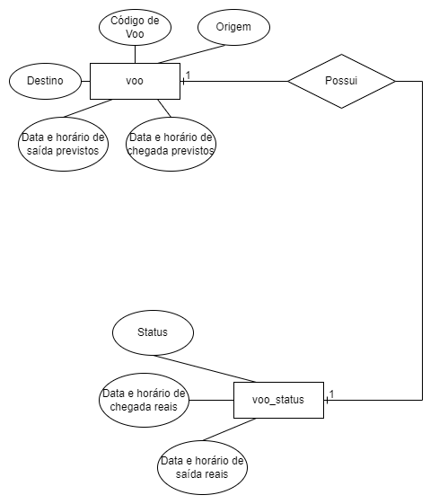
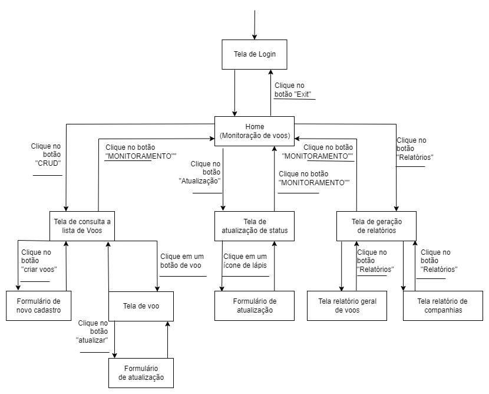

## Caqui: Monitoramento de Voos
Website para sistema de monitoramento de status de voos escrito em Django.

Projeto da disciplina PCS3643 - Laboratório de Engenharia de Software I de 2022 da Escola Politécnica da USP desenvolvido por:
  * Izabela Marina F. da Silva - 11808092
  * Lucas Carvalho Ramos - 10693382
  * Nícolas Varela Auler - 11819900

## Visão Geral
Essa aplicação implementa um sistema de monitoramento de voos, com controle de segurança baseado em logins e permissões de usuários e atualização de status baseada em inputs dos administradores.

Existem duas tabelas (Flights, FlightStatus) no banco de dados do sistema que podem ser testadas utilizando os testes automatizados do projeto.

A tabela de voos mantém informações estáticas dos voos e a tabela de status contém as informações que são atualizadas constantemente durante o processo de partida-chegada de um voo.

A relação dessas entidades é tal que:



É possível se guiar no acesso ao site utilizando o seguinte diagrama:



A documentação restante para compreensão do projeto pode ser encontrada na seção de [Documentação](/Documentação) desse repositório.

## Passos Iniciais
Para rodar esse projeto no seu computador:
1.  Inicialize um [ambiente virtual](https://developer.mozilla.org/en-US/docs/Learn/Server-side/Django/development_environment) em Python.
2.  Rode os comandos (se estiver no Windows você deve usar  ```py``` ou ```py-3``` em vez de ```python3``` para iniciar o Python):
```
pip3 install -r requirements.txt
python3 manage.py makemigrations
python3 manage.py migrate
```
3. Para rodar os testes use:
```
python3 manage.py test
```
5. Para rodar o site use:
```
python3 manage.py runserver
```
6. Para acessar o site hospedado na nuvem, basta entrar no [site do projeto](https://lcramos.pythonanywhere.com).
